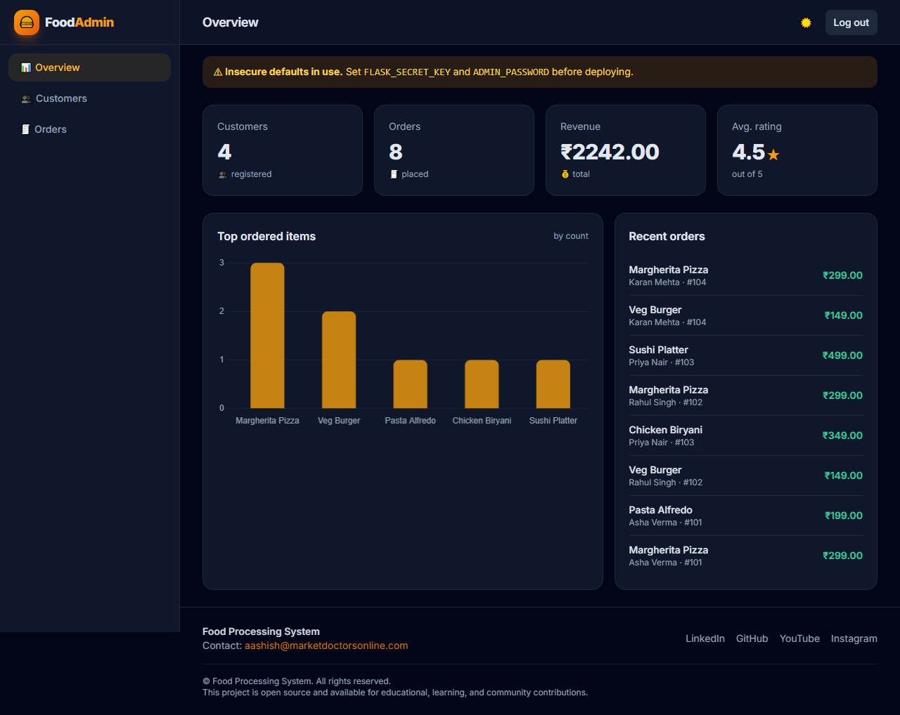
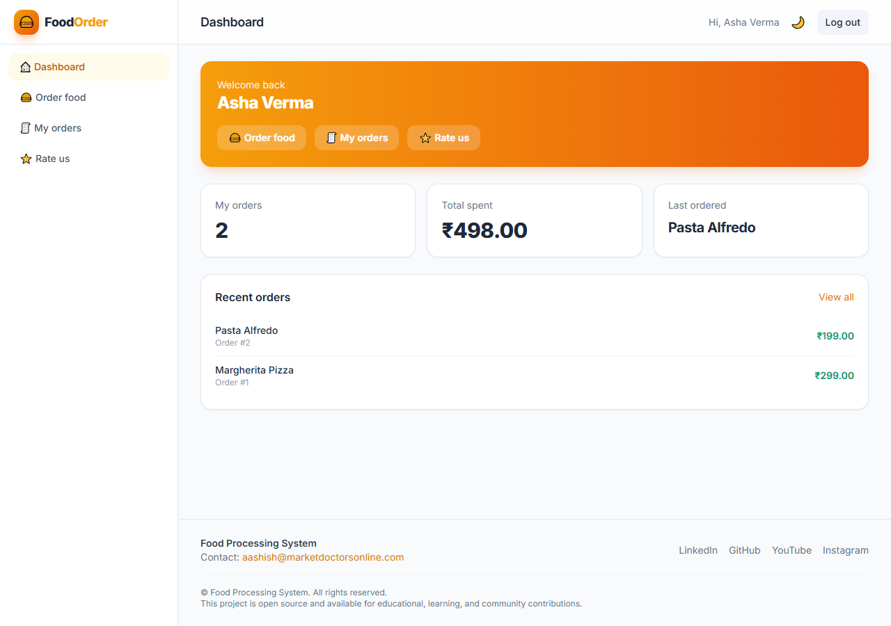
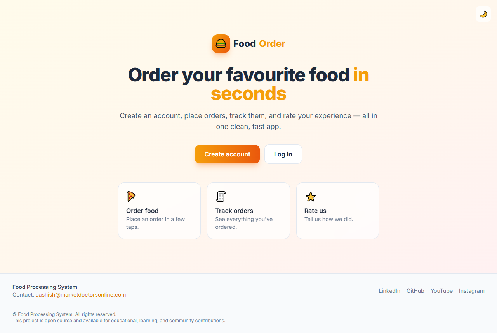

<div align="center">

# 🍔 Food Processing System

**A clean, production-ready command-line application for managing customer accounts and food orders.**

[](https://github.com/aashishbharti04/food-processing-system/actions/workflows/ci.yml)
[](https://www.python.org/)
[](LICENSE)
[](https://github.com/astral-sh/ruff)
[](tests)

</div>

---

## 📖 Project Overview

**Food Processing System** is a terminal application that lets customers create an
account, log in, place food orders, view orders and rate the service. It began as a
small academic project and has been refactored into a **layered, tested,
secure and installable Python package** — while preserving every original feature.

It ships with **two interchangeable database backends**:

- **SQLite** — zero configuration, works out of the box (great for trying it out, demos and CI).
- **MySQL** — production backend, configured entirely through environment variables.

## ✨ Features

- 👤 **Account management** — register and securely log in.
- 🔐 **Secure passwords** — salted **PBKDF2-HMAC-SHA256** hashing (no plaintext, ever).
- 🛡️ **SQL-injection safe** — every query is fully parameterised.
- 🍕 **Place & view orders** — record orders and list them in a clean table.
- 👥 **View customers** — list registered customers.
- ✏️ **Update profile** — real `UPDATE` (the original mistakenly inserted duplicates).
- ⭐ **Rate the service** — collect 1–5 ratings.
- 🎨 **Modern terminal UI** — colours, banners, spinners (loading state), empty & error states, ASCII fallback for legacy consoles.
- 🖥️ **Web app** *(optional)* — Flask + Jinja, two faces sharing the same services:
  a **customer app** (register, log in, order, view your orders, rate) at `/` and an
  **admin dashboard** (stats, chart, customer/order tables) at `/admin`. CSRF-protected
  auth, responsive, dark/light mode.
- 🔌 **Pluggable backends** — switch between SQLite and MySQL with one env var.
- ✅ **Fully tested** — pytest suite that runs without any external services.
- 📦 **Installable** — proper `pyproject.toml`, console entry point, type hints throughout.

## 🖼️ Screenshots

### Admin dashboard



### Customer dashboard



### Customer landing page



### Command-line interface

> Terminal preview of the main menu and order flow.

```text
╔════════════════════════════════════════════════════════════╗
║                    ORDER YOUR FOOD HERE                     ║
║                   Food Processing System                    ║
╚════════════════════════════════════════════════════════════╝

  1. Create your account
  2. Log in
  3. Exit

  Enter your choice: 2

▸ Log in
• Fill in your details to continue.
  Enter your name: Asha
  Enter your account number: 101
  Enter your password: ******
✔ Welcome to your food service, Asha!
```

<!-- Add real screenshots to the assets/ folder and reference them here, e.g.:

-->

## 🚀 Installation Guide

### Prerequisites

- **Python 3.10+**
- (Optional) **MySQL 8+** if you want the MySQL backend.

### Install

```bash
# 1. Clone
git clone https://github.com/aashishbharti04/food-processing-system.git
cd food-processing-system

# 2. (Recommended) create a virtual environment
python -m venv .venv
source .venv/bin/activate        # Windows: .venv\Scripts\activate

# 3. Install the package
pip install -e .

# Optional extras:
pip install -e ".[mysql]"        # MySQL backend
pip install -e ".[dotenv]"       # load config from a .env file
pip install -e ".[dev]"          # tests + linting + type checking
```

The app runs with **no third-party dependencies** on the default SQLite backend.

## 🎮 Usage Guide

```bash
# Run via the installed console script
food-processing-system

# …or as a module
python -m food_processing_system
```

You'll be greeted by the main menu:

1. **Create your account** — register with a name, account number, address and password.
2. **Log in** — authenticate, then choose from:
   1. See customer details
   2. Update your details
   3. Exit
   4. Order food
   5. See ordered food
   6. Rate us
3. **Exit**

## 🖥️ Web App (optional)

A modern web layer built with **Flask + Jinja**, reusing the same services and
database as the CLI — no duplicated logic. It serves two areas from one process:

| Area | URL | Who | What |
|------|-----|-----|------|
| **Customer app** | `/` | Customers | Register, log in, place orders, view *your* orders, rate the service. |
| **Admin dashboard** | `/admin` | Administrators | Stat cards (customers, orders, revenue, avg rating), a "top ordered items" chart, searchable customer & order tables. |

Both feature CSRF-protected auth, responsive layouts, dark/light mode, and empty/error states.

```bash
# Install the web extra
pip install -e ".[web]"

# Configure (a strong secret + admin password are recommended)
export FLASK_SECRET_KEY="$(python -c 'import secrets;print(secrets.token_hex(32))')"
export ADMIN_PASSWORD="your-strong-password"

# Run it (serves the customer app and the admin dashboard)
food-processing-dashboard           # or: python -m food_processing_system.web
# ➜ Customer app:    http://127.0.0.1:5000/
# ➜ Admin dashboard: http://127.0.0.1:5000/admin
```

Customers sign up via the web form. For the admin area, out of the box (no env set)
you can log in with the demo credentials **`admin` / `admin123`**; the dashboard
shows an insecure-defaults warning until you set `FLASK_SECRET_KEY` and
`ADMIN_PASSWORD`.

See the [Screenshots](#️-screenshots) section above for the admin dashboard,
customer dashboard, and landing page.

For production, run it behind a WSGI server — see [docs/DEPLOYMENT.md](docs/DEPLOYMENT.md).

## ⚙️ Configuration Guide

All configuration is read from **environment variables** (or an optional `.env` file).
Copy the template and edit it:

```bash
cp .env.example .env
```

| Variable      | Default     | Description                                   |
|---------------|-------------|-----------------------------------------------|
| `DB_BACKEND`  | `sqlite`    | `sqlite` or `mysql`                           |
| `SQLITE_PATH` | `food.db`   | SQLite file path (`:memory:` for ephemeral)   |
| `DB_HOST`     | `localhost` | MySQL host                                    |
| `DB_PORT`     | `3306`      | MySQL port                                    |
| `DB_USER`     | `root`      | MySQL user                                    |
| `DB_PASSWORD` | _(empty)_   | MySQL password                                |
| `DB_NAME`     | `food`      | MySQL database name                           |
| `NO_COLOR`    | `0`         | Set to `1` to disable coloured output         |
| `FLASK_SECRET_KEY` | _(dev default)_ | Secret key for the web dashboard sessions |
| `ADMIN_USERNAME`   | `admin`     | Dashboard login username                  |
| `ADMIN_PASSWORD`   | `admin123`  | Dashboard login password                  |
| `WEB_HOST`         | `127.0.0.1` | Dashboard bind host                       |
| `WEB_PORT`         | `5000`      | Dashboard port                            |

### Using MySQL

```bash
# Create the database once
mysql -u root -p -e "CREATE DATABASE food;"

# Point the app at MySQL
export DB_BACKEND=mysql
export DB_USER=root
export DB_PASSWORD=yourpassword
export DB_NAME=food

food-processing-system   # tables are created automatically on first run
```

## 🚢 Deployment Guide

This is a CLI tool, so "deployment" means **distribution**. See
[docs/DEPLOYMENT.md](docs/DEPLOYMENT.md) for full details. In short:

```bash
# Build a wheel + sdist
pip install build
python -m build

# Install anywhere
pip install dist/food_processing_system-1.0.0-py3-none-any.whl
```

For a containerised MySQL deployment, a sample `docker run` and environment setup
are documented in [docs/DEPLOYMENT.md](docs/DEPLOYMENT.md).

## 🤝 Contributing Guide

Contributions are welcome! Please read **[CONTRIBUTING.md](CONTRIBUTING.md)** and our
**[Code of Conduct](CODE_OF_CONDUCT.md)**. The short version:

```bash
pip install -e ".[dev]"
pytest          # run tests
ruff check .    # lint
mypy            # type-check
```

## ❓ FAQ

<details>
<summary><b>Do I need MySQL to run this?</b></summary>

No. The default SQLite backend needs no setup and no extra packages. MySQL is only
required if you set `DB_BACKEND=mysql`.
</details>

<details>
<summary><b>Where are passwords stored?</b></summary>

As salted PBKDF2-HMAC-SHA256 hashes — never in plaintext. See
[`security.py`](src/food_processing_system/security.py).
</details>

<details>
<summary><b>The box-drawing characters look odd in my terminal.</b></summary>

On legacy encodings the UI automatically falls back to ASCII symbols. On Windows,
the app reconfigures stdout to UTF-8 where possible.
</details>

<details>
<summary><b>How do I reset the database?</b></summary>

For SQLite, delete the file referenced by `SQLITE_PATH` (default `food.db`). The
schema is recreated automatically on the next run.
</details>

## 📄 License Information

Distributed under the **MIT License**. See [LICENSE](LICENSE) for the full text.

---

<div align="center">

### 🌐 Connect

**Aashish Bharti** · 📧 [aashish@marketdoctorsonline.com](mailto:aashish@marketdoctorsonline.com)

[](https://in.linkedin.com/in/aashana1012)
[](https://github.com/aashishbharti04)
[](https://www.youtube.com/@CodeWithAsur)
[](https://www.instagram.com/asurwave1012)

© Food Processing System. All rights reserved.

_This project is open source and available for educational, learning, and community contributions._

</div>
